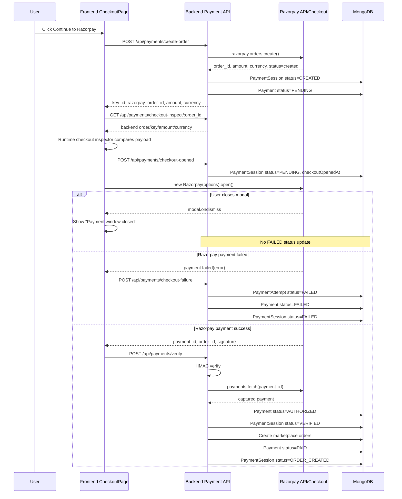

# Razorpay Runtime Lifecycle Audit

Generated: 2026-05-30

## Summary

The lifecycle audit found no backend path that marks a Razorpay payment/session as `FAILED` before either:

- Razorpay emits `payment.failed` in the frontend or webhook.
- Backend verification rejects a real Razorpay callback/signature/payment.
- Backend checkout-failure diagnostics validate that the failed checkout belongs to the current user/order.

The previous gap was missing server-side `Checkout Open` timestamping. That has been closed with `POST /api/payments/checkout-opened`, which records the exact checkout-open event and moves the `PaymentSession` from `CREATED` to `PENDING` immediately before Razorpay is opened.

## First Component That Assigns `FAILED`

For the current `Invalid Token` flow, the first component that assigns `FAILED` is:

- Frontend trigger: `CheckoutPage.jsx` Razorpay `payment.failed` callback.
- Backend endpoint: `POST /api/payments/checkout-failure`.
- Backend component: `paymentService.recordCheckoutFailure()`.
- Status updates:
  - `Payment.status = "FAILED"`
  - `PaymentSession.status = "FAILED"`
  - `PaymentAttempt.status = "FAILED"`

This happens after Razorpay returns the actual failure payload, not before checkout opens.

## Runtime Status Assignments

### Payment Session

| Component | Status | When |
| --- | --- | --- |
| `paymentService.createRazorpayOrder()` | `CREATED` | After Razorpay order creation and local `PaymentSession.create()` |
| `paymentService.recordCheckoutOpened()` | `PENDING` | Immediately before `new window.Razorpay(options)` |
| `paymentService.verifyRazorpayPayment()` | `VERIFIED` | After HMAC signature and Razorpay API payment validation |
| `paymentService.fulfillPaidPayment()` | `ORDER_CREATED` | After marketplace orders are created |
| `paymentService.recordCheckoutFailure()` | `FAILED` | After frontend Razorpay `payment.failed` callback |
| `webhookService.handleRazorpayWebhook()` | `FAILED` | After verified Razorpay `payment.failed` webhook |
| `paymentService.verifyRazorpayPayment()` | `FAILED` | After invalid signature verification |
| `paymentService.fulfillPaidPayment()` | `REFUND_PENDING` | If payment was captured but order fulfillment failed |
| `payment-maintenance.job` | `EXPIRED` | Only after `expiresAt <= now` for `CREATED`, `PENDING`, or `VERIFIED` sessions |

### Payment Record

| Component | Status | When |
| --- | --- | --- |
| `ensurePaymentRecordForSession()` | `PENDING` | Local payment record created for Razorpay order |
| `verifyRazorpayPayment()` | `AUTHORIZED` | Razorpay payment is fetched and confirmed captured |
| `fulfillPaidPayment()` | `PAID` | Marketplace orders created successfully |
| `recordCheckoutFailure()` | `FAILED` | Razorpay checkout returns `payment.failed` |
| `webhookService.handleRazorpayWebhook()` | `FAILED` | Verified Razorpay `payment.failed` webhook |
| `verifyRazorpayPayment()` | `FAILED` | Invalid HMAC signature |
| `fulfillPaidPayment()` | `REFUND_PENDING` | Captured payment but order creation failed |

## Sequence Diagram

## Race Condition Findings

- Duplicate verify submissions are controlled by `claimPaymentForFulfillment()`, which atomically moves fulfillment to `PROCESSING`.
- Duplicate payment IDs are protected by a unique partial index on `Payment.razorpayPaymentId`.
- Duplicate Razorpay order IDs are protected by a unique partial index on `Payment.razorpayOrderId`.
- Webhook duplicates are ignored through `WebhookEvent.eventId`.
- Race risk remains between frontend `/verify` and Razorpay `payment.captured` webhook, but both converge through `fulfillPaidPayment()` and the fulfillment lock.

## Background Job Findings

- `payment-maintenance.job` does not mark sessions `FAILED`.
- It marks old sessions `EXPIRED` only when:
  - status is `CREATED`, `PENDING`, or `VERIFIED`
  - `expiresAt <= now`
- Default expiration is controlled by Razorpay gateway `sessionTimeoutMinutes`, defaulting to 15 minutes.

## Lifecycle Violations

No forbidden flow was found after adding `checkout-opened`.

Forbidden flows checked:

- `CREATED -> FAILED -> Checkout Open`: not present.
- `PENDING -> FAILED -> Checkout Open`: not present.
- Background job `FAILED` before Razorpay callback: not present.
- Modal dismiss marking backend failed: not present.

## Runtime Timestamps Now Available

| Timestamp | Source |
| --- | --- |
| Order Creation | `PaymentAttempt(stage=create-order).createdAt` |
| Session Creation | `PaymentSession.createdAt` |
| Checkout Open | `PaymentSession.metadata.checkoutOpenedAt` and `PaymentAttempt(stage=checkout-opened).createdAt` |
| Checkout Failure | `PaymentAttempt(stage=checkout-payment-failed).createdAt` |
| Status Update | `Payment.updatedAt`, `PaymentSession.updatedAt`, `failedAt`, `verifiedAt`, `orderCreatedAt`, `expiredAt` |

## Conclusion

The visible `"Payment window closed"` message is not the source of `FAILED`; it is only frontend UI from Razorpay modal dismissal. For `Invalid Token`, the first backend `FAILED` assignment occurs only after the Razorpay `payment.failed` callback is received and posted to `/api/payments/checkout-failure`.
